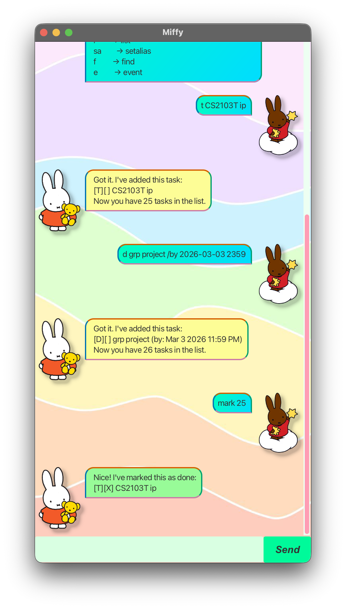

# Miffy User Guide 🐰

Miffy is a lightweight task management application optimised for use via a Graphical User Interface (GUI).  It's for people who love typing fast but also appreciate seeing things clearly.

Miffy helps you manage your todos, deadlines and events, with features for task marking, search and deletion.

## Quick start
1. Ensure you have Java 17 or above installed in your Computer.\
Mac users: Ensure you have the precise JDK version prescribed [here](https://se-education.org/guides/tutorials/javaInstallationMac.html).


2. Download the latest .jar file from [here](https://github.com/gracias022/ip/releases/tag/A-Release). 


3. Open a command terminal, `cd` into the folder you put the jar file in, and use the `java -jar miffy.jar` command to run the application.\
A GUI similar to the below should appear in a few seconds. Note how the app contains some sample data.  



4. Type the command in the command box and press Enter to execute it.\
Some example commands you can try:

- `list`: Lists all tasks.

- `todo borrow book`: Adds a todo with the description 'borrow book' to the task list.

- `mark 5`: Mark the 5th task shown in the current list as done.

- `delete 3` : Deletes the 3rd task shown in the current list.

- `bye` : Exits the app.

Refer to the [Features](#features) below for details of each command.

## Features

### Adding a todo: **`todo`**
Adds a todo to the application.

Format: `todo DESCRIPTION`
- The description can be of any length, but cannot be empty.

Example: `todo borrow book`

Expected Output:
```
Got it. I've added this task:
[T][ ] borrow book
Now you have 1 task in the list.
```
### Adding a deadline: **`deadline`**
Adds a task with a specific deadline to the list.

Format: `deadline DESCRIPTION /by YYYY-MM-DD HHMM`

- The description can be of any length, but cannot be empty.
- The date and time must follow the format YYYY-MM-DD HHMM (e.g. 2026-12-01 1800) for the application to recognize it.

Example: `deadline return book /by 2026-03-11 1400`

Expected Output:
```
Got it. I've added this task:
[D][ ] return book (by: March 11 2026 2:00PM)
Now you have 2 tasks in the list.
```
### Adding an event: **`event`**
Adds a task that occurs during a specific time period.

Format: `event DESCRIPTION /from YYYY-MM-DD HHMM /to YYYY-MM-DD HHMM`

Example: `event career fair /from 2025-05-15 0900 /to 2025-05-15 1700`

Expected Output:
```
Got it. I've added this task:
[E][ ] career fair (from: May 15 2025 9:00AM to: May 15 2026 5:00PM)
Now you have 3 tasks in the list.
```

### Delete a task: **`delete`**
Deletes the specified task from the tasklist by specifying its task number.

Format: `delete INDEX`

- Deletes the task at the specified INDEX.
- The index refers to the index number shown in the displayed task list when `list` is entered. 
- The index must be a positive integer 1, 2, 3, ...

Example: delete 2

Expected Output:
```
Noted. I've removed this task:
[D][ ] return book (by: March 11 2026 2:00PM)
Now you have 2 tasks in the list.
```

### Listing all tasks: **`list`**
Displays all the tasks currently saved in your list.

Format: `list`

Expected Output:
```
Here are the tasks in your list:
1. [T][ ] borrow book
2. [E][ ] career fair (from: May 15 2025 9:00AM to: May 15 2026 5:00PM)
```

### Marking or unmarking a task: **`mark`** or **`unmark`**
Updates the completion status of an existing task.

Format: `mark INDEX or unmark INDEX`

- The index refers to the task number shown in the current displayed list.
- The index must be a positive integer.

Examples:
- `mark 1`: Marks the first task in the list as completed. 
- `unmark 2`: Reverts the second task in the list to "not done".

Expected Output:
```
Nice! I've marked this task as done:
[T][X] borrow book
```
```
OK, I've marked this task as not done yet:
[E][ ] career fair (from: May 15 2025 9:00AM to: May 15 2026 5:00PM)
```

### Finding a task: **`find`**
Filters the task list to show only tasks containing a specific keyword in their description.

Format: `find KEYWORD`

Example: `find book`

Expected Output:
```
Here are the matching tasks in your list:
1. [T][ ] borrow book
```

### Listing all command alises: **`aliases`**
Displays a list of all current command shortcuts (aliases) currently active in the application. Miffy comes with a set of pre-defined default aliases to help you work faster right out of the box.

Format: `aliases`

Expected Output:
```
  Here are your aliases:
  ────────────────────
  Default:
  l          → list
  m          → mark
  al         → aliases
  t          → todo
  um         → unmark
  del        → delete
  d          → deadline
  e          → event
  f          → find
  sa         → setalias
```

### Set a custom command alias: **`setalias`** 
Creates a shortcut for an existing command to help you type even faster.
Format: setalias ALIAS ORIGINAL_COMMAND

Example: `setalias td todo`

Expected Output: 
```
Alias set: 'td' → 'todo'
```
You can now use 'td' instead of 'todo' to add tasks.

### Exiting the app: **`bye`**
Exits the app.\
Format: `bye`